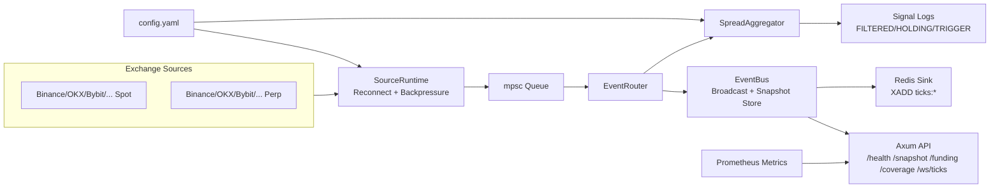

# arb-hunter-rs

Production-style Rust market data plane for multi-exchange crypto spot/perp aggregation, normalized APIs, funding coverage, and quality observability.


## Table of Contents

- [Why This Project](#why-this-project)
- [Tech Stack](#tech-stack)
- [Architecture](#architecture)
- [Runtime Pipeline](#runtime-pipeline)
- [Quick Start](#quick-start)
- [Configuration](#configuration)
- [API Overview](#api-overview)
- [API Details](#api-details)
- [Connection Model Matrix](#connection-model-matrix)
- [Bring-Up Guide](#bring-up-guide)
- [Testing](#testing)
- [Extend New Exchange](#extend-new-exchange)

## Why This Project

`arb-hunter-rs` solves three hard problems for quant teams:

- Unified market model across multiple exchanges and both `spot` / `perp`
- Unified API layer (`REST + WebSocket + Redis`) for downstream strategy systems
- Data quality visibility (funding coverage, stale ratio, latency percentiles, health status, alerts)

## Tech Stack

- Language: `Rust 2024`
- Runtime: `Tokio`
- HTTP/WS API: `Axum`
- WS clients: `tokio-tungstenite`
- Serialization: `serde`, `serde_json`, `serde_yaml`
- Metrics: `prometheus`
- Stream sink: `redis` (`XADD`)
- Logging: `tracing`, `tracing-subscriber`

## Architecture



## Runtime Pipeline

1. Exchange adapters subscribe to public market WS channels.
2. `SourceRuntime` supervises source tasks and reconnects with backoff.
3. `EventRouter` fans data to both `EventBus` and `SpreadAggregator`.
4. `EventBus` maintains latest snapshots and real-time broadcast stream.
5. `SpreadAggregator` computes cross-exchange opportunity signals with fee/slippage logic.
6. API/Redis expose normalized data to quant consumers.

## Quick Start

### 1) Run

```bash
ARB_CONFIG=./config.yaml cargo run
```

Use full-exchange sample:

```bash
ARB_CONFIG=./config.all-exchanges.example.yaml cargo run
```

### 2) Smoke check

```bash
curl -s http://127.0.0.1:8080/health
```

### 3) First data checks

```bash
curl -s "http://127.0.0.1:8080/snapshot?symbol=BTCUSDT" | jq
curl -s "http://127.0.0.1:8080/funding?symbols=BTCUSDT" | jq
curl -s "http://127.0.0.1:8080/coverage?market=perp&symbols=BTCUSDT" | jq
```

## Configuration

Default file: `config.yaml`

- `runtime.queue_capacity`: source->router channel capacity
- `runtime.backpressure`: `block` or `drop_newest`
- `runtime.report_interval_ms`: signal report interval
- `runtime.stale_ttl_ms`: stale threshold
- `runtime.api_addr`: API bind address
- `runtime.redis_url`: optional Redis sink
- `strategy.*`: min profit, hold, slippage model
- `symbols`: global spot symbols
- `perp_symbols`: global perp symbols
- `exchanges.<name>.enabled`: source switch
- `exchanges.<name>.symbols/perp_symbols`: per-exchange override
- `exchanges.<name>.fee`: fixed/tiered fee model

## API Overview

Base URL: `http://127.0.0.1:8080`

| Method | Path | Purpose |
|---|---|---|
| GET | `/` | Service metadata |
| GET | `/health` | Liveness check |
| GET | `/snapshot` | Latest normalized ticks |
| GET | `/funding` | Unified perp funding view |
| GET | `/coverage` | Data quality dashboard model |
| GET | `/metrics` | Prometheus metrics text |
| WS | `/ws/ticks` | Real-time normalized tick stream |

## API Details

### `GET /`

Returns service info.

Example:

```bash
curl -s http://127.0.0.1:8080/
```

### `GET /health`

Simple liveness endpoint.

Example:

```bash
curl -s http://127.0.0.1:8080/health
```

### `GET /snapshot`

Returns in-memory latest snapshots from `EventBus`.

Query params:

- `symbol` optional, e.g. `BTCUSDT`

Examples:

```bash
curl -s http://127.0.0.1:8080/snapshot | jq
curl -s "http://127.0.0.1:8080/snapshot?symbol=BTCUSDT" | jq
```

Key fields in each item:

- `exchange`, `market`, `symbol`
- `bid`, `ask`, `mark`, `funding`
- `ts`, `source_latency_ms`, `stale`

### `WS /ws/ticks`

Normalized tick stream subscription.

Query params:

- `symbols=BTCUSDT,ETHUSDT`
- `exchanges=okx,bybit`
- `market=spot|perp`

Example:

```bash
wscat -c "ws://127.0.0.1:8080/ws/ticks?market=perp&symbols=BTCUSDT"
```

### `GET /funding`

Unified perp funding view by canonical symbol.

Query params:

- `symbols=BTCUSDT,ETHUSDT`
- `exchanges=okx,bybit,bitget`
- `only_with_funding=true|false` default `true`
- `include_stale=true|false` default `false`

Examples:

```bash
curl -s "http://127.0.0.1:8080/funding" | jq
curl -s "http://127.0.0.1:8080/funding?symbols=BTCUSDT&exchanges=okx,bybit,bitget" | jq
```

Response model per symbol:

- `symbol`
- `exchanges_total`, `exchanges_with_funding`
- `min_funding`, `max_funding`, `funding_spread`
- `updated_at`
- `points[]` with `exchange/raw_symbol/funding/mark/stale/source_latency_ms/ts`

### `GET /coverage`

Dashboard-grade quality model with global summary, market summary, exchange summary, symbol detail, and alerts.

Query params:

- `symbols=BTCUSDT,ETHUSDT`
- `exchanges=okx,bybit,bitget,binance`
- `market=spot|perp`
- `include_stale=true|false` default `true`
- `only_with_funding=true|false` default `false`

Examples:

```bash
curl -s "http://127.0.0.1:8080/coverage" | jq
curl -s "http://127.0.0.1:8080/coverage?market=perp&symbols=BTCUSDT" | jq
curl -s "http://127.0.0.1:8080/coverage?market=perp&exchanges=okx,bybit,bitget" | jq
```

Top-level fields:

- `generated_at`
- `query` normalized effective filters
- `summary` global KPIs
- `summary.markets[]` market-level KPIs
- `exchange_summaries[]` per-exchange health profile
- `alerts[]` global/exchange/symbol alerts
- `symbols[]` symbol-level details

`summary` KPIs include:

- `total_symbols`, `total_points`
- `healthy_symbols`, `warning_symbols`, `critical_symbols`
- `stale_ratio`, `funding_coverage_ratio`
- `online_exchange_count`, `expected_exchange_count`, `exchange_online_ratio`
- `latency_ms_p50`, `latency_ms_p95`

`symbols[]` fields include:

- `symbol`, `market`, `health_status`, `alerts[]`
- `exchanges_total`, `exchanges_with_funding`, `funding_coverage_ratio`
- `exchanges_stale`, `stale_ratio`
- `latency_ms_min`, `latency_ms_p50`, `latency_ms_avg`, `latency_ms_p95`, `latency_ms_max`
- `points[]` per-exchange latest data

### `GET /metrics`

Prometheus text metrics endpoint.

Example:

```bash
curl -s http://127.0.0.1:8080/metrics
```

Current metrics include:

- `ticks_ingested_total`
- `bus_publish_total`
- `ws_subscribers`
- `redis_xadd_total`
- `ticks_dropped_total`

## Connection Model Matrix

| Exchange | Spot model | Perp model (this project) | Notes |
|---|---|---|---|
| Binance | Single WS combined stream | Single WS combined stream | Spot `stream.binance.com`, perp `fstream.binance.com` |
| OKX | Single WS multi-subscribe | Single WS multi-subscribe | `tickers` + `-SWAP` mapping |
| Bybit | Single WS multi-subscribe | Single WS multi-subscribe | v5 `spot` / `linear` |
| Bitget | Single WS multi-subscribe | Single WS multi-subscribe | v2 public WS |
| KuCoin | Single WS multi-topic | Single WS multi-topic | tokenized endpoint |
| Gate | Single WS multi-symbol | Single WS multi-symbol | separate spot/perp WS domains |
| Kraken | Single WS multi-symbol | Single WS multi-symbol | perp symbol naming is venue-specific |
| HTX | Single WS multi-channel | Single WS multi-channel | gzip payload |
| Bitfinex | Single WS multi-channel | Single WS multi-channel | `chanId -> symbol` map |
| Coinbase | Single WS multi-product | Not implemented | spot only in this project |

Perp adapters enabled in code:

- `okx_perp`, `bybit_perp`, `bitget_perp`, `binance_perp`, `kucoin_perp`, `gate_perp`, `kraken_perp`, `htx_perp`, `bitfinex_perp`

Perp symbol conversion defaults:

- Binance / Bybit / Bitget: `BTCUSDT`
- OKX / HTX: `BTC-USDT-SWAP` (OKX) / `BTC-USDT` (HTX)
- KuCoin Perp: `BTCUSDTM`
- Gate Perp: `BTC_USDT`
- Bitfinex Perp: `tBTCF0:USDTF0`
- Kraken Perp: pass-through (configure exact venue symbol)

## Bring-Up Guide

1. Start with one spot exchange (`binance` or `okx`) and verify steady snapshot updates.
2. Enable one perp exchange and verify `market=perp` plus `mark/funding` fields.
3. Enable two perp exchanges and verify `/funding` spread and `/coverage` health split.
4. Expand to full config and monitor `/coverage` + `/metrics` continuously.

Practical notes:

- If an exchange is region-restricted, keep `enabled: false`.
- Kraken perp symbol naming is pass-through in this repo.
- Coinbase is spot-only in this repo.

## Testing

Run checks:

```bash
cargo fmt
cargo check
cargo test
```

## Extend New Exchange

1. Add `src/exchanges/<name>.rs`
2. Implement `ExchangeSource`
3. Convert payloads into `MarketTick` (`Spot` or `Perp`)
4. Register source in `src/exchanges/registry.rs`

