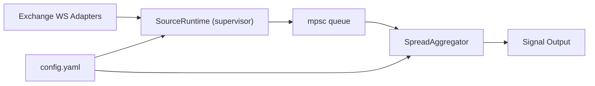

# arb-hunter-rs

Rust + Tokio multi-exchange WebSocket aggregator with spot/perp unified market model, fee-aware signal filtering, and production-style runtime controls.

## Architecture



## Runtime Pipeline

1. Exchange adapters ingest public WS market data.
2. `SourceRuntime` supervises each source with reconnect backoff.
3. Events are pushed into a bounded `tokio::sync::mpsc` queue.
4. `SpreadAggregator` computes best cross-exchange pairs per symbol.
5. Signals are filtered by fee/slippage/hold-time policy.

## Connection Model Matrix

| Exchange | Spot model | Perp model | Notes |
|---|---|---|---|
| Binance | Single WS, multi-symbol combined stream | N/A (in this project) | `.../stream?streams=` |
| OKX | Single WS, multi-symbol subscribe | Single WS, multi-symbol subscribe | `tickers` + `-SWAP` mapping |
| Bybit | Single WS, multi-symbol subscribe | Single WS, multi-symbol subscribe | v5 `spot` / `linear` |
| Bitget | Single WS, multi-symbol subscribe | Single WS, multi-symbol subscribe | v2 public WS |
| KuCoin | Single WS, multi-topic subscribe | N/A | tokenized endpoint |
| Gate | Single WS, multi-symbol subscribe | N/A | v4 `spot.book_ticker` |
| Coinbase | Single WS, multi-product subscribe | N/A | advanced trade ticker |
| Kraken | Single WS, multi-symbol subscribe | N/A | ws v2 ticker |
| HTX | Single WS, multi-channel subscribe | N/A | gzip binary payload |
| Bitfinex | Single WS, multi-subscribe channels | N/A | `chanId -> symbol` map |

## Signal Fields

- `gross`: raw spread (`sell_bid - buy_ask`)
- `gross_bps`: gross spread in bps
- `buy_fee`, `sell_fee`, `slip`: explicit cost components
- `fee_bps_total`, `slippage_bps_total`: total modeled cost in bps
- `net`, `net_bps`: post-cost edge
- `state`: `FILTERED` / `HOLDING` / `TRIGGER`

## Configuration

Default config file is `config.yaml`.

```bash
ARB_CONFIG=./config.yaml cargo run
```

## Testing

Run all tests:

```bash
cargo test
```

Current test coverage focuses on:

- fee tier selection behavior
- symbol mapping helpers
- cross-exchange pair selection (same-exchange exclusion)
- profit computation direction and cost dominance

## Extend New Exchange

1. Add `src/exchanges/<name>.rs`
2. Implement `ExchangeSource`
3. Map payloads to `MarketTick` (`Spot` or `Perp`)
4. Register in `src/exchanges/registry.rs`
